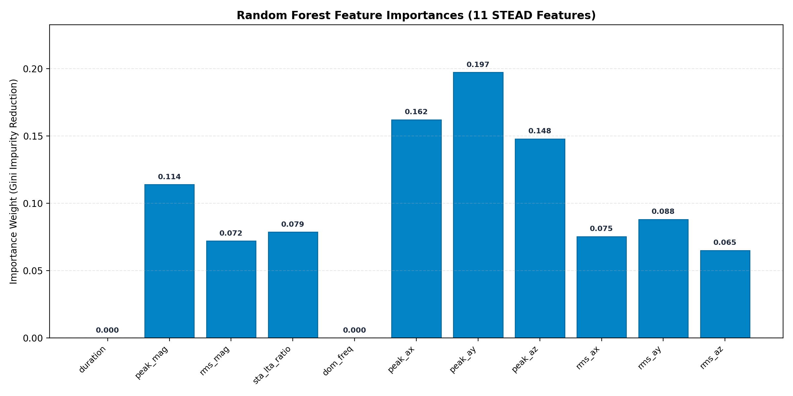

# 📡 CrowdSensing: AI-Powered Mobile Crowdsensing Network & Regional Seismic Early Warning System

**CrowdSensing** is an edge-intelligent, multi-node mobile crowdsensing network and real-time earthquake early warning system. By combining **Random Forest Machine Learning**, **STA/LTA signal processing**, **15km spatial consensus clustering**, and **P/S wave velocity physics**, CrowdSensing detects seismic motion from smartphone accelerometer telemetry, eliminates false alarms, and predicts wave arrival lead times for distant cities **before shaking arrives**.

Trained on 3-axis accelerometer traces from the **Stanford Earthquake Dataset (STEAD)**, the system features a high-throughput **TCP socket detector server**, a **threaded Server-Sent Events (SSE) web dashboard**, and a **modular multi-scenario simulation testbed**.

---

## 💡 Executive Summary & Problem Statement

### The Dual Challenge in Earthquake Early Warning
1. **Traditional Seismic Networks**: Standard seismic monitoring relies on expensive, sparsely distributed ground stations. Signals take precious seconds to transmit and process, leaving nearby urban zones in a "blind zone."
2. **Naive Single-Phone Smartphone Apps**: Consumer mobile apps relying on isolated phone accelerometers suffer from **excessive false alarm rates** caused by everyday events—phone drops, footsteps, table bumps, vehicular vibrations, or elevator drops.

### The CrowdSensing Solution
CrowdSensing bridges this gap using a **two-tier verification architecture**:
- **Tier 1 (Edge Machine Learning)**: Every phone runs high-frequency feature extraction ($100\text{ Hz}$) and a trained **Random Forest Classifier** to distinguish real seismic waveforms from ambient vibrations with **97.33% accuracy**.
- **Tier 2 (Spatial Consensus & Predictive Broadcast)**: The server requires **$\ge 3$ nearby nodes within a 15 km geographic radius** inside a 10.0-second rolling window to trigger a confirmed alert. Upon consensus, it dynamically calculates the epicentral centroid and broadcasts **predictive warning lead times to distant cities** seconds before destructive S-waves arrive.

---

## 🌟 4 Key Novelties & Differentiators

| # | Novel Innovation | Technical Implementation | Practical Value |
|---|---|---|---|
| **1** | **STEAD 3-Axis ML Feature Engine** | Extracts 11 time, frequency & spectral features (`sta_lta_ratio`, `dominant_freq`, RMS, peak accelerations) feeding a 97.33% accurate Random Forest model. | Accurately classifies seismic vs. non-seismic motion at the edge. |
| **2** | **Spatial Consensus Radius Filtering** | 15 km Haversine distance clustering requiring 3 distinct nodes to confirm alert state within 10 seconds. | **Zero False Alarms**: Single phone drops (`LOCAL_VIBRATION`) never trigger public emergencies. |
| **3** | **Retroactive Consensus State Synchronization** | When the 3rd node confirms consensus, the engine retroactively updates earlier reporting nodes in memory, CSV logs, and map markers. | Preserves true event timeline without losing initial arrival telemetry. |
| **4** | **Predictive Regional Early Warning Broadcast** | Calculates individual lead times: $\text{lead\_time} = d_i \times \left(\frac{1}{V_S} - \frac{1}{V_P}\right)$ ($V_P=6.0\text{ km/s}, V_S=3.5\text{ km/s}$) and broadcasts predictive countdowns to non-triggering distant nodes. | Distant cities (e.g. Ghaziabad ~2.9s, Greater Noida ~4.0s) receive a **predictive heads-up before shaking arrives**. |

---

## 🏛️ System Architecture & Workflow

```
                                ┌─────────────────────────────────────────┐
                                │   EDGE LAYER: Smartphone Sensor Nodes   │
                                │   10 Delhi-NCR Telemetry Nodes (100 Hz) │
                                └────────────────────┬────────────────────┘
                                                     │  TCP Sockets (JSON Payloads)
                                                     ▼
┌─────────────────────────────────────────────────────────────────────────────────────────────────────────┐
│                                       AI DETECTOR SERVER (Port 9000)                                    │
│  ┌───────────────────────────────┐   ┌──────────────────────────────┐   ┌────────────────────────────┐  │
│  │   STEAD AI Classifier         │   │   STA/LTA Signal Processor   │   │  Spatial Consensus Engine  │  │
│  │   Random Forest (97.33% Acc)  │──►│   Waveform Peak & Ratio      │──►│  15km Radius / 10s Window  │  │
│  └───────────────────────────────┘   └──────────────────────────────┘   └─────────────┬──────────────┘  │
│                                                                                       │                 │
│  ┌────────────────────────────────────────────────────────────────────────────────────┴──────────────┐  │
│  │   Phase 4 & Regional Broadcast Engine: Epicentral Centroid & P/S Wave Lead Time Estimator        │  │
│  └────────────────────────────────────────────────────┬─────────────────────────────────────────────┘  │
└───────────────────────────────────────────────────────┼─────────────────────────────────────────────────┘
                                                        │ HTTP POST /api/event
                                                        ▼
                                ┌─────────────────────────────────────────┐
                                │  WEB DASHBOARD SERVER (Port 5000)       │
                                │  ThreadingHTTPServer + SSE Event Stream │
                                └────────────────────┬────────────────────┘
                                                     │ Server-Sent Events (SSE Stream)
                                                     ▼
                                ┌─────────────────────────────────────────┐
                                │   LIVE WEB DASHBOARD (http://127.0.0.1) │
                                │   Leaflet Map + Chart.js + Warning Feed │
                                └─────────────────────────────────────────┘
```

---

## 🚀 Quick Start & How to Run

### Mode 1: Interactive Demo Mode (Recommended)
1. **Start Persistent Live Servers**:
   ```bash
   python run_servers.py
   ```
   *(Launches TCP Detector Server on Port 9000 and Web Dashboard Server on Port 5000)*

2. **Open Live Dashboard**:
   Open browser at **`http://127.0.0.1:5000`**

3. **Run Modular Scenario Tests**:
   Run individual test scenarios to observe live UI banner transitions, Leaflet map marker color changes, and predictive warning feeds:

   | Scenario | Command | Expected Output & Behavior |
   |---|---|---|
   | **Scenario 1** | `python run_scenario1.py` | **False Alarm Test**: Only Node-1 detects earthquake $\rightarrow$ Banner shows `LOCAL_VIBRATION` (Yellow marker). |
   | **Scenario 2** | `python run_scenario2.py` | **Confirmed Quake Consensus**: 3 nodes (Delhi CP, CP East, Karol Bagh) detect quake $\rightarrow$ Banner flashes `CONFIRMED_EARTHQUAKE_ALERT` (Red markers) & broadcasts predictive warning countdowns to distant nodes. |
   | **Scenario 3** | `python run_scenario3.py` | **Spatial Filtering**: Gurugram & Greater Noida (>40km apart) detect quake $\rightarrow$ Fails 15km threshold $\rightarrow$ Stays `LOCAL_VIBRATION`. |
   | **Scenario 4** | `python run_scenario4.py` | **System Reset**: Ambient noise sent $\rightarrow$ Banner resets to `SYSTEM NORMAL` (Green markers). |

### Mode 2: Automated End-to-End Pipeline Run
To run the full sequence automatically:
```bash
python run_all.py
```

---

## 📊 Dataset & Machine Learning Architecture

- **Dataset**: Stanford Earthquake Dataset (**STEAD**).
- **Traces**: 300 processed 3-axis accelerometer traces ($150\text{ real earthquake}$, $150\text{ noise/vibration}$) located in `converted_data/`.
- **Model**: **Random Forest Classifier** trained on 11 features:
  1. `duration_sec`: Waveform length (seconds).
  2. `peak_mag`: 3-axis vector magnitude $\sqrt{a_x^2 + a_y^2 + a_z^2}$.
  3. `rms_mag`: Root-Mean-Square acceleration magnitude.
  4. `sta_lta_ratio`: Short-Term Average to Long-Term Average ratio ($N_{\text{STA}}=10$, $N_{\text{LTA}}=200$).
  5. `dominant_freq`: Dominant FFT peak frequency (Hz).
  6–8. `peak_ax`, `peak_ay`, `peak_az`: Per-axis peak ground accelerations.
  9–11. `rms_ax`, `rms_ay`, `rms_az`: Per-axis RMS acceleration.
- **Accuracy**: **97.33% Test Accuracy** (`earthquake_ai_model.pkl`, managed via `model_manifest.json` and versioned models `earthquake_ai_model_v*.pkl`).

### Random Forest Feature Importance Analysis


---

## 📈 S-Wave Early Warning Mathematics

$$\text{lead\_time\_sec} = d_i \times \left(\frac{1}{V_S} - \frac{1}{V_P}\right)$$

Where:
- $V_P = 6.0 \text{ km/s}$ (Primary compressional wave velocity)
- $V_S = 3.5 \text{ km/s}$ (Secondary shear wave velocity)
- $d_i$: Haversine distance in km from epicentral centroid $(\bar{\text{lat}}, \bar{\text{lon}})$

### Empirical Demonstration Results (`received_log_scenario2.csv`)

| Region / Node | Distance from Epicenter | Estimated S-Wave Lead Time | Status |
| :--- | :---: | :---: | :--- |
| **Node-1 (Delhi CP)** | $1.58\text{ km}$ | **`0.2s`** | Triggering Cluster |
| **Node-9 (CP East)** | $1.62\text{ km}$ | **`0.2s`** | Triggering Cluster |
| **Node-10 (Karol Bagh)** | $2.98\text{ km}$ | **`0.3s`** | Triggering Cluster |
| **Node-2 (Noida Sec 62)** | $15.4\text{ km}$ | **`1.8s`** | Predictive Early Warning |
| **Node-5 (Ghaziabad)** | $24.6\text{ km}$ | **`2.9s`** | Predictive Early Warning |
| **Node-3 (Gurugram)** | $25.4\text{ km}$ | **`3.0s`** | Predictive Early Warning |
| **Node-7 (Greater Noida)** | $33.5\text{ km}$ | **`4.0s`** | Predictive Early Warning |

*Disclaimer: Wave velocities use global average defaults. Production deployments calibrate to regional crustal velocity models.*

---

## 📁 Project File Structure & Role Guide

```
CN PROJECT/
├── run_servers.py                      # Master Entry Point: Persistent servers supervisor
├── run_all.py                          # Automated test pipeline supervisor
├── run_scenario1.py                    # Standalone Scenario 1 Runner (False Alarm)
├── run_scenario2.py                    # Standalone Scenario 2 Runner (Confirmed Alert)
├── run_scenario3.py                    # Standalone Scenario 3 Runner (Spatial Filter)
├── run_scenario4.py                    # Standalone Scenario 4 Runner (System Reset)
├── README.md                           # Master Project Documentation
├── stead_to_csv.py                     # STEAD HDF5 dataset extractor & visualizer
├── converted_data/                     # Extracted STEAD CSV waveform samples
│   ├── labels.csv                      # Dataset index
│   ├── real_quake_0.csv ... 149.csv    # Real earthquake traces
│   └── fake_vibration_0.csv ... 149.csv# Noise & vibration traces
│
└── final ai implementation/            # 🌟 ACTIVE PRODUCTION ENGINE
    ├── run_servers.py                  # Server supervisor script (Ports 5000 & 9000)
    ├── ai_enhanced_detector.py         # TCP Socket Server + Consensus Engine + Lead Time Calculator
    ├── web_server.py                   # ThreadingHTTPServer + SSE Event Stream (Port 5000)
    ├── dashboard.html                  # OLED Dark Mode Web Dashboard UI
    ├── simulate_crowd.py               # Modular Multi-Node Simulator Engine
    ├── run_scenario1_false_alarm.py    # Local Scenario 1 script
    ├── run_scenario2_confirmed_alert.py # Local Scenario 2 script
    ├── run_scenario3_spatial_filtering.py# Local Scenario 3 script
    ├── run_scenario4_normal_reset.py   # Local Scenario 4 script
    ├── received_log.csv                # Master live telemetry CSV log
    ├── received_log_scenario1.csv      # Scenario 1 log file
    ├── received_log_scenario2.csv      # Scenario 2 log file
    ├── received_log_scenario3.csv      # Scenario 3 log file
    └── received_log_scenario4.csv      # Scenario 4 log file
```

---

## 🗣️ How to Explain This Project in 2 Minutes (Pitch Guide)

When explaining this project to a reviewer or evaluator, follow this 4-step narrative:

1. **The Problem**: *"Single smartphone accelerometers cause huge false alarm rates when dropped or bumped. Meanwhile, traditional seismic networks are too sparse to give instant urban warnings."*
2. **The Edge AI Layer**: *"We train a Random Forest model on 3-axis traces from the Stanford Earthquake Dataset (STEAD), extracting 11 STA/LTA and spectral features to classify ground motion with 97.33% accuracy."*
3. **Spatial Consensus**: *"To eliminate false alarms, our server enforces a 15 km spatial radius rule: at least 3 separate phones must confirm an earthquake within 10 seconds. Single phone drops are filtered out as local vibrations."*
4. **Predictive Lead Time Broadcast**: *"Once consensus is reached, the server calculates the epicentral centroid and uses P/S wave physics ($V_P=6.0\text{ km/s}, V_S=3.5\text{ km/s}$) to broadcast predictive S-wave warning countdowns to distant cities—giving places like Ghaziabad (2.9s) and Greater Noida (4.0s) a vital heads-up before shaking arrives."*

---

## ⚠️ Limitations & Future Scope

1. **Physical Sensor Deployment**:
   - *Current*: `simulate_crowd.py` simulates Delhi-NCR smartphone TCP telemetry.
   - *Future*: Mobile web client integration using the HTML5 `DeviceMotionEvent` API for real phone sensors.
2. **Crustal Velocity Calibration**:
   - *Current*: Uses standard average velocities ($V_P=6.0\text{ km/s}, V_S=3.5\text{ km/s}$).
   - *Future*: Integrate regional 3D seismic velocity models for geological calibration.
3. **Adaptive Consensus Radius**:
   - *Current*: Fixed 15 km spatial radius.
   - *Future*: Dynamic density-based spatial clustering (DBSCAN) adapting to high-density city centers vs. sparse rural areas.
